<p align="center">
  <a href="https://yann-paillard.fr"></a>
  <a href="https://www.linkedin.com/in/yann-paillard"></a>
  <a href="https://nablify.com"></a>
</p>

<p align="center">
  
</p>

<p align="center">
  
</p>

<br/>

<h3 align="center"><code>apt list --installed</code></h3>

<p align="center">
  
  
  
  
  
  
  
</p>
<p align="center">
  
  
  
  
  
</p>
<p align="center">
  
  
  
  
  
  
  
  
  
</p>
<p align="center">
  
  
  
  
  
  
  
</p>

<h3 align="center"><code>ls ~/projects</code></h3>

<p align="center">
  <a href="https://github.com/Payll/mywebsite"></a>
  <a href="https://github.com/Payll/Test-spring-boot"></a>
  <a href="https://github.com/Payll/Intelligo"></a>
</p>

<table align="center">
  <thead><tr><th>dir</th><th></th><th>repos</th></tr></thead>
  <tbody>
    <tr><td><a href="https://github.com/Payll?tab=repositories&q=topic%3Apersonal"><code>personal/</code></a></td><td><sub>active</sub></td><td><a href="https://github.com/Payll/mywebsite">mywebsite</a> <sub>personal website, SvelteKit</sub> · <a href="https://github.com/Payll/Test-spring-boot">Test-spring-boot</a> <sub>Spring Boot REST API experiment</sub> · <sub><i>+2 private</i></sub></td></tr>
    <tr><td><a href="https://github.com/Payll?tab=repositories&q=topic%3Aschool-esir"><code>school-esir/</code></a></td><td><sub>archived</sub></td><td><a href="https://github.com/Payll/Intelligo">Intelligo</a> <sub>public transport display, team project</sub> · <a href="https://github.com/Payll/TPProjet-DMB">TPProjet-DMB</a> <sub>Spark data analysis</sub> · <a href="https://github.com/Payll/TP1_DMB">TP1_DMB</a> <sub>PySpark lab</sub> · <a href="https://github.com/Payll/AI-S9">AI-S9</a> <sub>AI labs, notebooks</sub> · <a href="https://github.com/Payll/JAVA_STRUCT">JAVA_STRUCT</a> <sub>Java data structures</sub> · <a href="https://github.com/Payll/Trie">Trie</a> <sub>trie in Python</sub> · <a href="https://github.com/Payll/DevOps">DevOps</a> <sub>DevOps course, Java</sub> · <a href="https://github.com/Payll/devops-1">devops-1</a> <sub>DevOps course fork</sub> · <a href="https://github.com/Payll/VV-ESIR-TP3">VV-ESIR-TP3</a> <sub>V&V lab fork</sub> · <a href="https://github.com/Payll/WebServer-course">WebServer-course</a> <sub>web server course fork</sub> · <sub><i>+4 private</i></sub></td></tr>
    <tr><td><a href="https://github.com/Payll?tab=repositories&q=topic%3Acompetitive-programming"><code>competitive-programming/</code></a></td><td><sub>archived</sub></td><td><a href="https://github.com/Payll/EXO_SWERC">EXO_SWERC</a> <sub>SWERC training, Python</sub> · <a href="https://github.com/Payll/Launcher">Launcher</a> <sub>Kattis CLI launcher</sub> · <sub><i>+1 private</i></sub></td></tr>
    <tr><td><a href="https://github.com/Payll?tab=repositories&q=topic%3Ainternship"><code>internship/</code></a></td><td><sub>archived</sub></td><td><sub><i>+2 private</i></sub></td></tr>
    <tr><td><a href="https://github.com/Payll?tab=repositories&q=topic%3Aearly-projects"><code>early-projects/</code></a></td><td><sub>archived</sub></td><td><sub><i>+12 private</i></sub></td></tr>
  </tbody>
</table>

<p align="center"><sub>each dir = a GitHub topic · click a dir to filter</sub></p>

<h3 align="center"><code>git log --stat</code></h3>

<p align="center">
  
  
  
</p>
<p align="center">
  
</p>

```text
payll@github:~$ exit
Connection to github.com closed.
```
